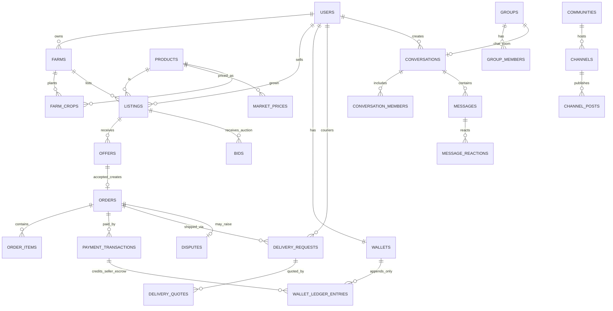

# Database

PostgreSQL 16. All primary keys are 32-char UUID-hex strings generated in
Python (`app.errors.new_id`). Timestamps are `timestamptz`. Money columns are
`BigInteger` **minor units** (100 minor = 1 RWF).

## Conventions

- Soft delete: `deleted_at timestamptz NULL` on user-visible entities
  (BaseModel vs SoftDeleteModel in `backend/app/models/base.py`).
- Optimistic concurrency: `updated_at` maintained by SQLAlchemy `onupdate`;
  sync cursors use it.
- Client-supplied idempotency keys: `messages.client_message_id`,
  `wallet_ledger_entries.idempotency_key`, `sync_operations.client_op_id`,
  `payment_transactions.provider_reference`.

## Entity groups

| Module | Tables |
| ------ | ------ |
| Identity | users, farmer_profiles, buyer_profiles, logistics_profiles, expert_profiles, cooperative_profiles, farms, farm_crops, blocked_users, device_tokens |
| Catalog | products, product_categories, units_of_measure, market_price_sources, market_prices, advisory_articles |
| Marketplace | listings, listing_images, offers, bids, buyer_requests, inventories |
| Orders & logistics | orders, order_items, delivery_requests, delivery_quotes, vehicles |
| Payments | wallets, wallet_ledger_entries, payment_transactions, withdrawals, platform_fees |
| Messaging | conversations, conversation_members, messages, message_reactions, message_reads, saved_messages |
| Groups | groups, group_members, group_roles, group_permissions, group_invites, group_join_requests, group_announcements, group_bans, group_knowledge_items, group_documents, moderation_actions |
| Communities | communities, community_members, channels, channel_posts, channel_subscriptions |
| Social | status_posts, status_views, polls, poll_options, poll_votes, events, event_rsvps, reminders |
| Calls | calls, call_participants |
| Notifications | notifications, notification_preferences |
| Trust & disputes | reviews, verifications, disputes, dispute_messages, audit_logs, risk_events |
| Sync | sync_operations |

118 tables total (`db.create_all()` count).

## Core ERD (mermaid)

## Money flow invariant

Every balance change inserts exactly one `wallet_ledger_entries` row:

- `entry_type ∈ {CREDIT, DEBIT}`, signed `amount_minor`,
- `balance_after_minor` snapshot for auditability,
- unique `idempotency_key` prevents double application (webhook replays,
  outbox duplicates),
- seller credits are split: gross → escrow (`pending`) → available on
  clearance; the platform fee is a DEBIT to the sink wallet
  (`platform-fee-sink` user).
